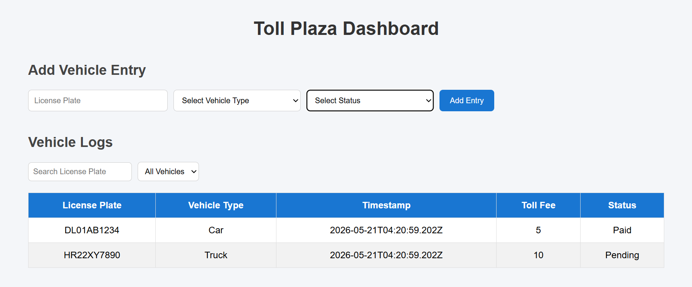
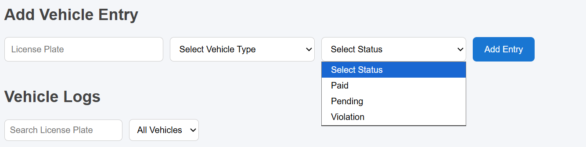
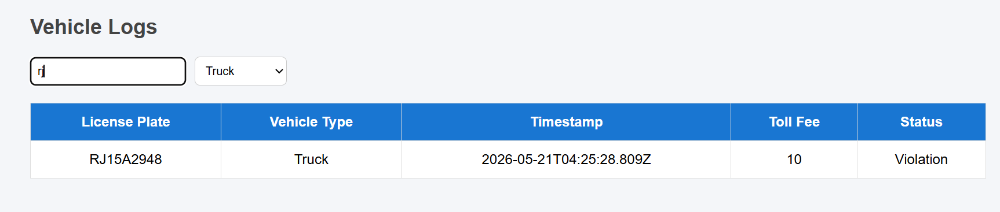

# Toll Plaza Dashboard

A mini full-stack application built using Angular and NestJS for managing toll plaza vehicle entries.

## Features

- View vehicle logs
- Add new vehicle entries
- Automatic toll fee calculation
- Search vehicles by license plate
- Filter vehicles by type
- Manual toll status selection
  - Paid
  - Pending
  - Violation
- Responsive dashboard UI

---

# Tech Stack

## Frontend
- Angular

## Backend
- NestJS
- Node.js

---

# Toll Fee Rules

| Vehicle Type | Fee |
|---|---|
| Car | $5 |
| Motorcycle | $2 |
| Truck | $10 |
| Government Vehicle | $0 |

---

# Project Structure

```bash
toll-plaza-app/
│
├── frontend/
├── backend/
└── README.md
```

---

# Run Backend

```bash
cd backend
npm install
npm run start:dev
```

Backend runs on:

```bash
http://localhost:3000
```

---

# Run Frontend

```bash
cd frontend
npm install
ng serve
```

Frontend runs on:

```bash
http://localhost:4200
```

---

# API Endpoints

## GET Logs

```bash
GET /logs
```

## Create Log

```bash
POST /logs
```

Example Request:

```json
{
  "licensePlate": "UK07AB1234",
  "vehicleType": "Car",
  "status": "Paid"
}
```

---
# Screenshots

## Dashboard



---

## Vehicle Entry Form



---

## Filtering Feature



---

# Author

Mohit Kharayat